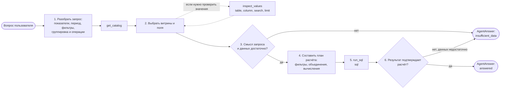

# SQL-волшебник

Пользователь задаёт вопрос на естественном языке и получает ответ на основе данных витрин.

## Компоненты

- **Интерфейс — `run.ipynb`** 
- **Агент**
- **Хранилище и каталог :** БД и бизнес-описания витрин и показателей.
- **MCP-сервер:** MCP-сервер предоставляет инструменты просмотра данных и выполнения SQL.

## Схема работы агента



## Каталог

Для каждой витрины: назначение, смысл одной строки, поля и допустимые связи. Для показателей: бизнес-определения, синонимы, соответствующие поля, единицы измерения и правила расчёта. Для дат: соответствующие поля и периодичность данных.


## Структура проекта

```text
src/magician/
├── config.py
├── agent/
│   ├── graph.py
│   ├── models.py
│   ├── nodes.py
│   └── prompts.py
├── storage/
│   ├── catalog.py
│   ├── query.py
│   └── demo.py
└── mcp/
    └── server.py
```

`agent` содержит логику рассуждения, `storage` — каталог и безопасную работу с
DuckDB, а `mcp` — внешний интерфейс к хранилищу. Общие пути и лимиты находятся
в `config.py`.

## Пример

Запрос: «Среднее значение активов по банковскому сектору за последние 3 месяца».

Если определения в каталоге однозначно задают среднее суммарных активов сектора за три завершённых календарных месяца: выбрать эти месяцы, сложить активы банков на каждую месячную отчётную дату и усреднить три суммы.

Если смысл среднего не определён или данные за нужные месяцы отсутствуют — завершить работу с объяснением причины.

## Тестовое хранилище

В MVP используется локальная DuckDB-база `data/demo.duckdb`. Она создаётся
детерминированно и содержит пять таблиц:

| Таблица | Гранулярность |
| --- | --- |
| `dim_region` | один регион |
| `dim_bank` | один банк |
| `fact_balance_monthly` | банк × месяц, снимок на конец месяца |
| `fact_income_monthly` | банк × месяц, поток за месяц |
| `fact_customers_monthly` | банк × месяц × клиентский сегмент |

Полное описание полей, показателей, допустимых связей и качества тестовых данных
находится в `data/catalog.yaml`. Клиентские данные перед объединением с другими
фактами необходимо агрегировать до уровня банка и месяца.

Создание базы:

```bash
uv sync --no-editable
uv run --no-editable sql-agent-init-db
```

Флаг `--force` пересоздаёт существующую тестовую базу.

## MCP-сервер

Локальный сервер запускается по stdio:

```bash
uv run --no-editable sql-agent-mcp
```

Пример конфигурации MCP-хоста после `uv sync --no-editable`:

```json
{
  "mcpServers": {
    "sql-agent-storage": {
      "command": "/absolute/path/to/magician/.venv/bin/sql-agent-mcp"
    }
  }
}
```

Он предоставляет три инструмента:

- `get_catalog()` возвращает весь бизнес-каталог;
- `inspect_values(table, column, search?, limit?)` ищет значения только в разрешённых категориальных полях;
- `run_sql(sql)` выполняет один `SELECT` или `WITH ... SELECT` по таблицам каталога.

`run_sql` разбирает SQL, запрещает неизвестные таблицы и квалифицированные
системные имена, открывает DuckDB только для чтения и без внешнего доступа,
останавливает запрос через 5 секунд и возвращает не более 200 строк.

База и каталог читаются из `data/demo.duckdb` и `data/catalog.yaml` в корне
проекта, который определяется самим приложением.

## Запуск агента

1. Создать `.env` по образцу `.env.example` и указать `API_KEY`, `API_MODEL`
   и `API_BASE_URL`. Команды запускать из корня проекта; при запуске
   из другого каталога указать `MAGICIAN_PROJECT_ROOT`.
   Все переменные окружения загружаются в `src/magician/config.py`; остальные
   модули импортируют из него готовые значения.
2. Установить зависимости и создать тестовую базу:

```bash
uv sync --no-editable
uv run sql-agent-init-db
```

3. Открыть `run.ipynb`, выбрать ядро из `.venv` и выполнить ячейки сверху вниз.

Публичная функция `await run_agent(question)` возвращает `AgentAnswer` со
статусом `answered` или `insufficient_data`. Для успешного ответа контракт
содержит краткий ответ, план расчёта, фактически выполненный SQL, результат и
использованные поля. При нехватке данных агент возвращает причину и не задаёт
уточняющих вопросов.

Изолированная проверка совместимости API с tool calling:

```bash
RUN_API_INTEGRATION=1 uv run --no-editable pytest -q tests/test_api_tool_calling.py
```

Тест делает реальные вызовы внешнего API и без `RUN_API_INTEGRATION=1`
автоматически пропускается.
