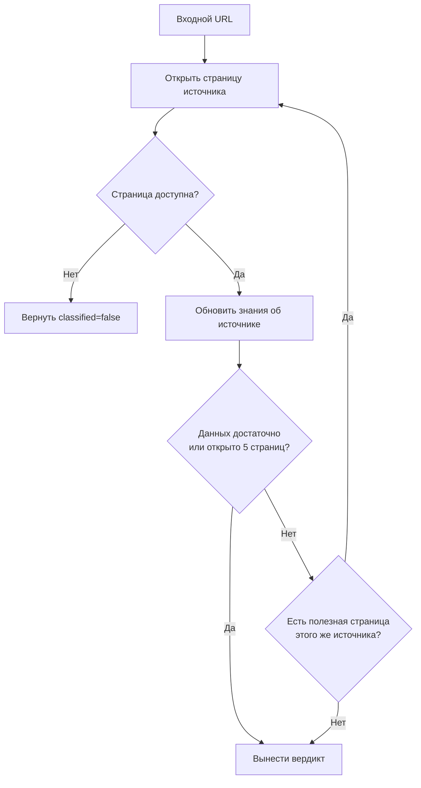

# Source Classifier

LangGraph-агент для классификации источников по URL. `run.ipynb` построчно читает URL из XLSX, вызывает агента и после обработки каждого URL записывает ответ в колонку `labels`.

## Результат

```python
class ClassifiedSource(BaseModel):
    input_url: str
    canonical_url: str | None
    source_name: str | None
    geography: list[str]
    topics: list[str]
    source_type: str
    evidence_urls: list[str]
    explanation: str
    classified: bool
```

Категории выбираются из закрытой таксономии. Если данных недостаточно, агент возвращает `classified=false`, не угадывая метки.

## Схема работы



Агент оценивает источник в целом, а не тему одной публикации. Исходный URL входит в лимит из пяти страниц. После каждого перехода агент обновляет накопленные сведения и при необходимости выбирает следующую полезную страницу того же источника. Веб-поиск и внешние сайты не используются.

Агент завершает исследование раньше лимита, если источник однозначно определён и для выбранных меток достаточно доказательств. В `evidence_urls` попадают только страницы, которые использованы при вынесении вердикта. Если входной URL недоступен, источник не удалось идентифицировать или ключевые метки нельзя подтвердить, агент возвращает `classified=false`.

## Структура

```text
run.ipynb              # чтение URL и запись ответов в labels
src/agent/graph.py      # граф, промпт и веб-инструменты
src/agent/models.py     # структуры данных
src/agent/taxonomy.py   # допустимые метки
data/                   # локальные XLSX
```
