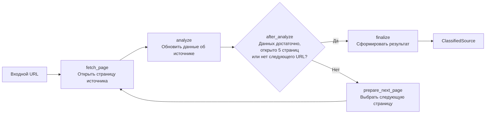

# Source Classifier

LangGraph-агент для классификации источников по URL. `run.ipynb` построчно читает URL из XLSX, вызывает агента и после обработки каждого URL записывает ответ в колонку `labels`.

## Результат

```python
class ClassifiedSource(BaseModel):
    input_url: str
    canonical_url: str | None
    source_name: str | None
    geography: list[str]
    topics: list[str]
    source_type: str
    evidence_urls: list[str]
    explanation: str
    classified: bool
```

Категории выбираются из закрытой таксономии. Если данных недостаточно, агент возвращает `classified=false`, не угадывая метки.

## Схема работы



Агент оценивает источник в целом, а не тему одной публикации. Исходный URL входит в лимит из пяти страниц. После каждого перехода агент обновляет накопленные сведения и при необходимости выбирает следующую полезную страницу того же источника. Веб-поиск и внешние сайты не используются.

Агент завершает исследование раньше лимита, если источник однозначно определён и для выбранных меток достаточно доказательств. LLM выбирает следующую страницу по её номеру в списке доступных ссылок. `canonical_url` определяется по первой успешно открытой странице, а в `evidence_urls` попадают URL всех успешно открытых страниц. Если входной URL недоступен, источник не удалось идентифицировать или ключевые метки нельзя подтвердить, агент возвращает `classified=false`.

## Структура

```text
run.ipynb              # чтение URL и запись ответов в labels
src/agent/graph.py      # сборка графа и публичный запуск
src/agent/nodes.py      # узлы графа и правила переходов
src/agent/utils.py      # HTTP, URL и LLM-инфраструктура
src/agent/models.py     # модели, состояние, таксономия и промпт
data/                   # локальные XLSX
```

## Запуск

1. Заполнить `GEOGRAPHY`, `TOPICS` и `SOURCE_TYPES` в `src/agent/models.py`.
2. Указать в `.env` переменные `OPENAI_MODEL`, `OPENAI_API_KEY` и при необходимости `OPENAI_BASE_URL`.
3. Установить проект: `pip install -e .`.
4. Указать путь к XLSX в `run.ipynb` и выполнить ячейки сверху вниз.
